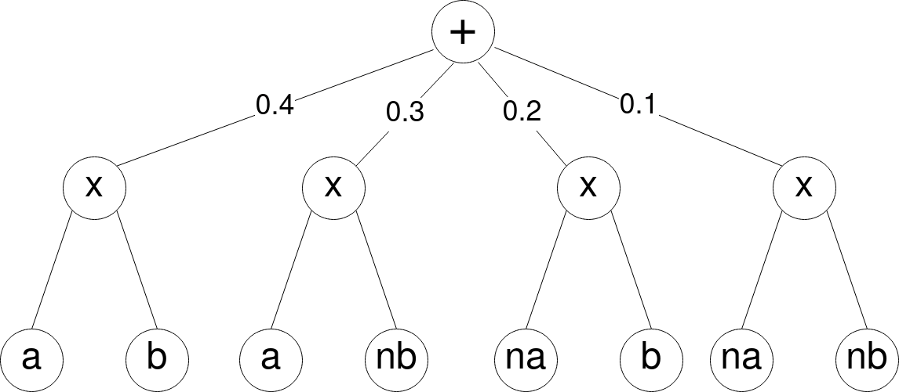
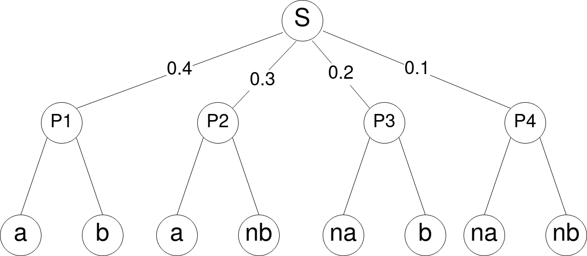

# Building a Simple PC with RPCircuits

In this section, we teach the basics of RPCircuits package. If you're new to Sum-Product Networks or Probabilistic Circuits (PCs), previous knowledge about the subject is highly recommended (for more information, take a look [here][survey][2]).


As an example, we start building a simple Circuit with 8 indicator nodes, 4 products and 1 sum. There are different ways to build PCs using this package, the easiest one uses a bottom-up strategy. See `pc_example.ipynb` for an interactive notebook.



First we have the foundation of the PC, the **leaf** nodes. In this case the variables **a**, **b** and their respective negations **na** and **nb**. To declare an indicator leaf node using RPCircuits, we call the function `Indicator()`, that needs **three** arguments. The first argument simply refers to the variable's `scope` (the indices of the variables associated with the Indicator node). The second argument, corresponds to the `value` such that the Indicator node outputs `true` (if `value = 1.0`, the Indicator node outputs `true` only when its input is `1.0`). The third argument is **optional** and corresponds to a tolerance threshold (think of the indicator as a Dirac delta function with some tolerance level to handle floating point impreciseness). Using the RPCircuit package, we have

```julia
julia> a = Indicator(1, 1.)
Circuit with 1 node (0 sums, 0 products, 1 leaf) and 1 variable:
  1 : indicator 1 1.0
julia> b = Indicator(2, 1.)
Circuit with 1 node (0 sums, 0 products, 1 leaf) and 1 variable:
  1 : indicator 2 1.0
julia> na, nb = Indicator(1, 0.), Indicator(2, 0.)
(indicator 1 0.0, indicator 2 0.0)
```

Next, in the second layer with 4 **product** nodes. To define a product `P`, we only need to call the function `Product(v)`, where `v`  is the vector containing all children of `P`. Hence, we can build the four products of our PC by

```julia
julia> P1 = Product([a,b])
Circuit with 3 nodes (0 sums, 1 product, 2 leaves) and 2 variables:
  1 : * 1 2
  2 : indicator 2 1.0
  3 : indicator 1 1.0

julia> P2, P3, P4 = Product([a,nb]), Product([na,b]), Product([na,nb])
(* 1 2, * 1 2, * 1 2)
```

At last, we have the **sum** node. To define a sum  node `S`, we have to call the function `Sum(v, w)`, where `v` is the vector of children of `S`; and `w` is the vector of corresponding weights. This can easily be done by

```julia
julia> S = Sum([P1, P2, P3, P4], [0.4, 0.3, 0.2, 0.1])
Circuit with 9 nodes (1 sum, 4 products, 4 leaves) and 2 variables:
  1 : + 1 0.4 2 0.3 3 0.2 4 0.1
  2 : * 1 2
  3 : * 1 2
  4 : indicator 1 0.0
  5 : * 1 2
  6 : indicator 2 0.0
  7 : * 1 2
  8 : indicator 2 1.0
  9 : indicator 1 1.0
```

Hence, we have the circuit



To see the `scope` of a circuit rooted at a node `C`, we can type `scope(C)`. Therefore, the scope of our circuit is

```julia
julia> scope(S)
BitSet with 2 elements:
  1
  2
```

Using RPCircuits, it is possible to randomly sample complete configurations of the variables associated with a circuit `C`. We can do this using the function `rand(C)`, that creates a sample according to the probability defined by the PC.

```julia
julia> rand(S)
2-element Vector{Float64}:
 0.0
 1.0
```

 Passing a positive integer `N` to `rand(C, N)`, creates `N` random samples.

```julia
julia> rand(S, 1_000)
1000×2 Matrix{Float64}:
 1.0  0.0
 1.0  0.0
 1.0  0.0
 0.0  1.0
 1.0  0.0
 1.0  1.0
 1.0  0.0
 1.0  0.0
 1.0  0.0
 1.0  1.0
 1.0  0.0
 1.0  0.0
 1.0  1.0
 ⋮    
 1.0  1.0
 0.0  1.0
 1.0  0.0
 0.0  0.0
 1.0  1.0
 0.0  0.0
 1.0  1.0
 1.0  1.0
 1.0  0.0
 1.0  0.0
 1.0  0.0
 0.0  1.0
```


With the function `NLL(S, D)`, we have the `Negative Log-Likelihood` of the PC `S` w.r.t the dataset `D`.

```julia
julia> NLL(S,D)
1.2905776805822866
```


Suppose that we have an initial circuit `S_em = Sum([P1, P2, P3, P4], [0.25, 0.25, 0.25, 0.25])` and we want to learn the function `S` (such that configurations `(a,b)`, `(a,nb)`, `(na,b)` and `(na, nb)` have respective probabilities `0.4`, `0.3`, `0.2` and `0.1`). Firstly, we can check the initial `NLL` of our model `S_em` in relation to the dataset `D`.

```julia
julia> S_em = Sum([P1, P2, P3, P4], [0.25, 0.25, 0.25, 0.25])
Circuit with 9 nodes (1 sum, 4 products, 4 leaves) and 2 variables:
  1 : + 1 0.25 2 0.25 3 0.25 4 0.25
  2 : * 1 2
  3 : * 1 2
  4 : indicator 1 0.0
  5 : * 1 2
  6 : indicator 2 0.0
  7 : * 1 2
  8 : indicator 2 1.0
  9 : indicator 1 1.0

julia> println("Initial NLL = ", NLL(S_em, D))
Initial NLL = 1.3862943611198937
```

Now, we can pass both our circuit `S_em` and the dataset `D` as an input to the `EM` algorithm (Expectation-Maximization algorithm, more about it [here][murphy][3]). To do this, we first define the learner `L = SEM(S)`. Then, we have `m` calls of the `update` function, for `m` iterations of the `EM` algorithm.

```julia
julia> L_em = SEM(S_em)
julia> for i = 1:100
           update(L_em, D)
       end
```

At last, we can apply the `NLL` function another time, to see the improvement obtained by the learning process.

```julia
julia> println("Final NLL = ", NLL(S_em, D))
Final NLL = 1.2846005853473226
```

Similarly, we can use the Gradient Descent algorithm (more about it [here][murphy][3]) to learn a circuit `Sgrad` w.r.t the dataset `D`. In this process, we have a sligthly different approach, because we initalize the sum-weights `w` close zero (more to know about it [here][trapp][4]), by using the `Distributions` package.

```julia
julia> using Distributions

julia> w = Distributions.rand(Distributions.truncated(Distributions.Normal(0, 0.1), 0, Inf), 4)
4-element Vector{Float64}:
 0.06188858628551688
 0.0595922631891463
 0.052955660645701744
 0.011508850149691349

julia> Sgrad = Sum([P1, P2, P3, P4], w)
Circuit with 9 nodes (1 sum, 4 products, 4 leaves) and 2 variables:
  1 : + 1 0.06188858628551688 2 0.0595922631891463 3 0.052955660645701744 4 0.0…
  2 : * 1 2
  3 : * 1 2
  4 : indicator 1 0.0
  5 : * 1 2
  6 : indicator 2 0.0
  7 : * 1 2
  8 : indicator 2 1.0
  9 : indicator 1 1.0

julia> Lgrad = Gradient(Sgrad); # ';' hides output
```

Since the circuit `Sgrad` is not normalized, we need to compute its **normalizing constant**. We do this by using the function `log_norm_const!` that outputs the `log` of the normalizing constant (`norm_V` is an auxiliary vector in the process of computing `norm_const`).

```julia
julia> normV = Vector{Float64}(undef, length(S));

julia> norm_const = RPCircuits.log_norm_const!(normV, Lgrad.circ.C)
-1.6823024104143856

Now, it is possible to obtain the real `NLL` of `Sgrad` w.r.t `D` by adding `nomr_const` to `NLL(Sgrad, D)`

```julia
julia> println("Initial NLL = ", NLL(Sgrad, D) + norm_const)
Initial NLL = 1.3237494967673191
```

Finally, we can apply the Gradient Descent algorithm to `Sgrad` w.r.t `D` and then see the improvement obtained by the learning process.

```julia
julia> for i = 1:1_000
        update(Lgrad, D; learningrate=0.01)
       end

julia> norm_const = RPCircuits.log_norm_const!(normV, Lgrad.circ.C) # New normalizing constant of the circuit

julia> println("Final NLL = ", NLL(Sgrad, D) + norm_const)
Final NLL = 1.3118771877259712
```

[survey]: [https://arxiv.org/pdf/2004.01167.pdf]
[murphy]: https://probml.github.io/pml-book/book1.html
[trapp]: https://arxiv.org/abs/1905.08196